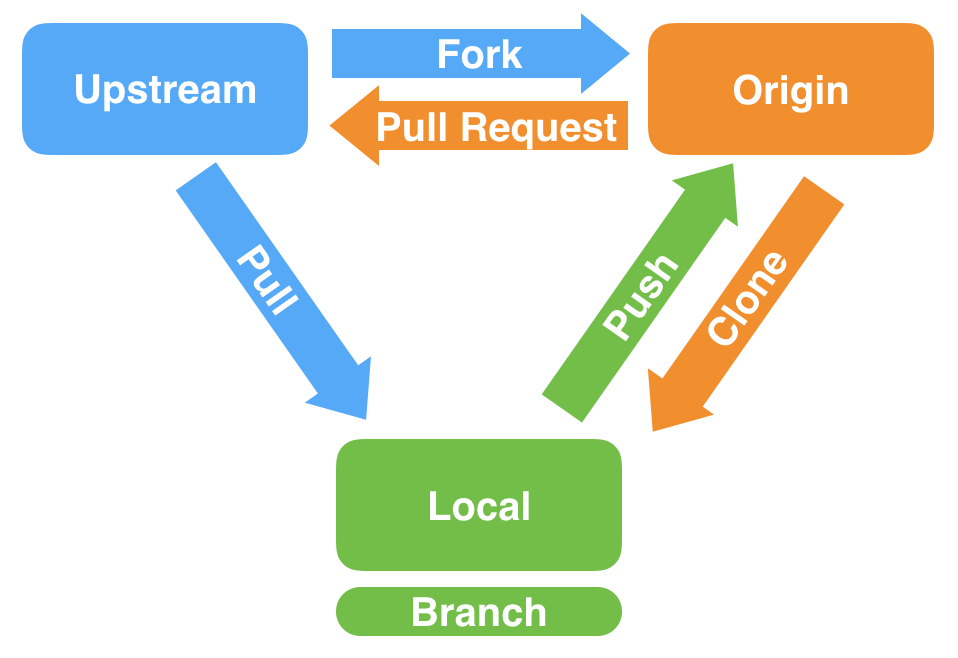

# Git Team Workflow Cheatsheet

1. [Create a Slack Team](https://slack.com/create) if you haven't already done so
1. [Create an Organization on GitHub](https://help.github.com/articles/creating-a-new-organization-account/)
1. Create a repo in the organization (initialize with a readme.md) 
    - do this on GitHub, not in your terminal
1. Each team member, fork the repo and clone it to your machine (clone your own fork)
1. `git remote add upstream` + the clone or download link for the organization's repo
  - Type `git remote -v` in your terminal to make sure that you have fetch and push versions for `origin` (your fork) and `upstream` (the organization's repo) 
1. Always work on a branch!
1. When you're ready to merge (**only merge working code!!!**), `git pull upstream master` to check for mergability with the organization's repo's master branch.
1. Fix any merge conflicts *locally*, then add, commit, and push the branch to your fork (`git push origin` + the branch name)
1. On GitHub, [create a pull request](https://help.github.com/articles/creating-a-pull-request/)
1. Whoever is in charge of the organization's repo, merge the pull request into the master branch
  - All team members should be notified that the master has been updated (check out [GitHub integrations with Slack](https://get.slack.help/hc/en-us/articles/232289568-Use-GitHub-with-Slack))
  - *Merging pull requests in a timely manner will help other team members by allowing them to handle merge conflicts before submitting pull requests of their own*
1. When your pull request has been merged:
  - `git checkout master`
  - `git pull upstream master`
  - `git push origin master`
  - make a new branch!

