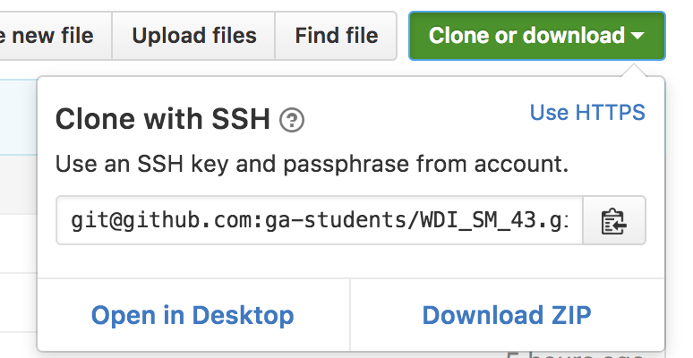
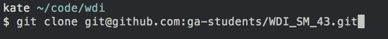

# Intro to Our Dev Environment

### Objectives
*After this lesson, students will be able to:*

- Navigate to their `~/code/wdi` folder
- Access the class repo locally and pull changes
- Use Spectacle for window management
- Use keyboard shortcuts to perform routine tasks

## `~/code/wdi`

The installfest script created a directory called `code` in your root directory. This is a good place to store all of your code so that it is easily accessible.

Inside `code` is another directory called `wdi`. This is a good place to store all of your class work, labs, and projects. It is also a good place in which to clone the class repo.

This organizational structure is only a suggestion. You may store your code wherever and however works best for you. But, figure it out now, because it's time to...

## Clone the Class Repo

The class repo is where we will put markdowns for lessons, starter code, project requirements, and any other files we need to share with you. The easiest way for you to access these files is to clone the class repo onto your machine and run `git pull` every time you need to update your version (whenever we push something new).

Go to [https://github.com/ga-students/WDI_SM_43](https://github.com/ga-students/WDI_SM_43). *If you get a 404 message, check to make sure you are logged in to GitHub. The repo is private.*

In your terminal, navigate to where you would like your local copy of the repo to be on your machine. One good place is `~/code/wdi`. **You cannot have repos inside other repos, so make sure wherever you plan to clone the repo is not already a git repo. Check by typing `git status`.*

Back on GitHub, click on the green "Clone or download" button make sure it says "Clone with SSH", and click the clipboard to copy.

In your terminal, type `git clone ` and paste the copied link. Then push enter.

Done!

Now when we tell you to pull from the class repo, you will navigate to this directory and type `git pull`.

## Spectacle

[Spectacle](https://www.spectacleapp.com/) is a window management tool that you can download on Mac.

To start Spectacle, do a spotlight search. You'll know it's running when the icon is in your menu bar.  

## Keyboard Shortcuts

We can use keyboard shortcuts for window management in Spectacle, copying and pasting text, opening and closing tabs, and much more. It might not seem like it right away, but keyboard shortcuts will save you lots of time in the long run.

There's a handy [cheatsheet](https://github.com/ga-students/WDI_SM_43/blob/master/cheatsheets/keyboard_shortcuts.md) with tons of information in the cheatsheets directory.

## Conclusion

It will take a little bit of time to get used to the dev environment and using keyboard shortcuts, but pretty soon it will all feel like second nature.