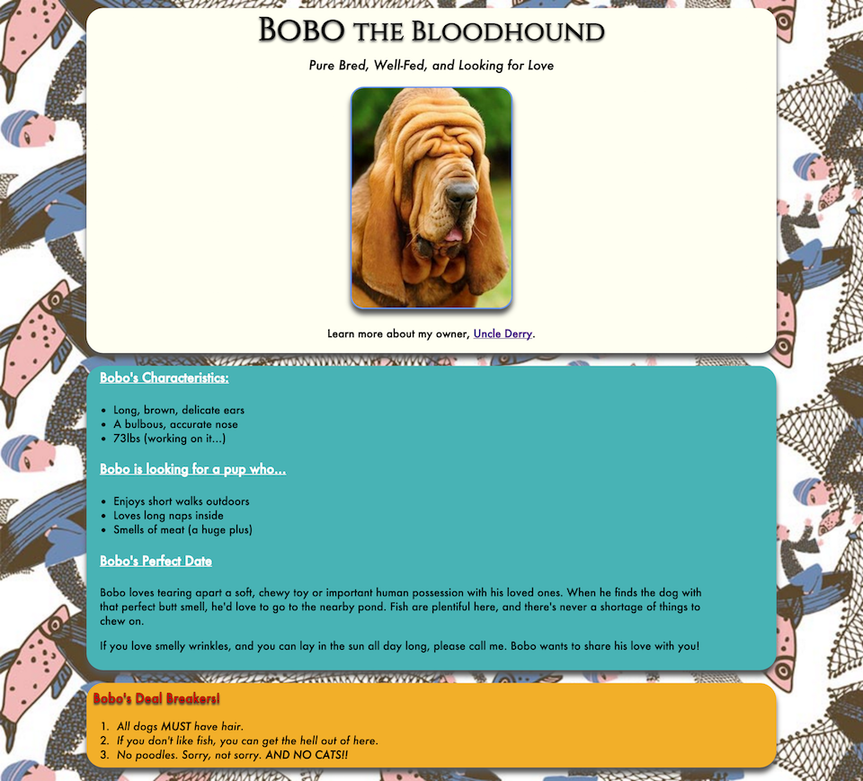

# Uncle Derry's Dog Needs a Date


## HTML/CSS Lab

Well, lemme tell you, my terribly sad Uncle Derry has been projecting onto his dog again, and is determined he needs to help his pup, Bobo, find someone special.

Living alone near a pond more sewage than water leads you to do some crazy things, but it also affords you a lot of thinking time.  Good ol' Uncle Derry has been trying to build website with those lonely hours.

While this seems positive, ever since he found out I was a web developer, he's been *hounding* me for help. Now he needs me to find a date for his dog - it's time to make some dog dating webpages!

#### Final Result

At the end of this lab, your page might resemble something like this:



**Make dating options and/or competition profiles for Uncle Derry's Dog.**

We just need him to believe other dogs are out there.

## Lab

This lab will happen in 3 steps.

1. Create profile website. (40 minutes)
2. Trade webpages with your neighbor. Constructively critique the site, help with syntax, and point out what was confusing. (10 minutes)
3. Discuss what you found. (5 minutes)

### Part 0 - Setup

- Create a new directory called `puppy_love` inside your workspace, maybe even inside 01-week

> did you know you can create nested folders with `mkdir -p`?

- Initialize a new empty git repository for your work.

> Ensure you're working **outside** of your `wdi_sm_43` folder!

- Create a remote repo on github so you can push up your work!

### Part 1 - Create Profile Website (40 Minutes)

**Using HTML & CSS, build a webpage.** The webpage must have:

- a `<head>`
- the necessary metadata for the head: `meta` tags, `title`, etc.
- a `<body>` with well-structured content

#### HTML Content

For your HTML content, you must:

- A page title with a top heading (e.g. Bobo the Bloodhound), and a secondary heading (e.g. Pure Bred, Well-fed and Looking for Love)
- Images and at least one link
- Two lists
  - Attributes of your pup
  - Attributes of what your pup is looking for
- Explain a perfect date in at least two paragraphs
- Emphasize deal breakers!
- Use comments to divide the sections to assist your neighbor (e.g. `<!-- Deal Breakers -->`)

#### CSS

In your CSS, please incorporate:

- Classes for grouped items
- **No** inline styling
- A separate stylesheet linked to your html page
- Place all stylesheets inside a `/css` directory
- Add color and style to the text and background, edit borders, text, and spacing
- A Google Font

### Part 2 - Trade!

- Push up your work to github!
- Have your neighbor fork and clone down your repo

> Did you know you when you clone a repo you can change the name of the directory?

```sh
git clone [git_url] [new_directory_name]
```
> for instance

```sh
# makes a directory called wdi_sm_22
git clone https://github.com/ga-students/WDI_sm_43

# writes files to a directory called fruit_cake
git clone https://github.com/ga-students/WDI_sm_43 fruit_cake
```

- Read through your partner's code.

If you find mistakes, fix them, but write down what you do - **we want to help each other find the bugs!**

Use the following style guide to check the webpage:

**HTML**

- [ ] All necessary boilerplate (`<head>`, `<!DOCTYPE html>`, etc.)
- [ ] HTML structures separated by comments
- [ ] Semantic tags, both *structural* (e.g. `<footer>`, `<header>`, etc.) and *typographic* (`<strong>`, `<em>`, etc.)
- [ ] Indentation convention used is 2-space tabs
- [ ] All text surrounded by tags
- [ ] Appropriate attributes for html tags
  - [ ] `alt` for ``
  - [ ] `src` for ``
  - [ ] `href` for `<a>`
  - [ ] `href` for `<link>`

**CSS**

- [ ] Clear syntax
- [ ] Clear use of classes
- [ ] No ids
- [ ] Legible styling
- [ ] If using CSS Inheritance, it is easily read

### Part 3 - Discuss

Talk through your changes.
Tell your partner what you found, especially the parts you found difficult to understand in their code. Remember to be specific. Think:

- Which section was difficult to understand?
- How could they have improved their naming conventions or tag use?
- What element of the code prompted your confusion?

## Bonus!

Validate your Code!
- [W3C HTML validator](https://validator.w3.org/#validate_by_input)
- [W3C CSS validator](https://jigsaw.w3.org/css-validator/#validate_by_input)
- Read all the warnings and errors and discuss with your neighbors what they mean.
- Make the changes and revalidate!

## Show Off Your Pup Profile!


You've done great work in the land of pup love!

More than that you're making this here pup extremely happy… or at the very least, his lugubrious owner think he is. Be sure to see if your pup matches with anyone else the class!
