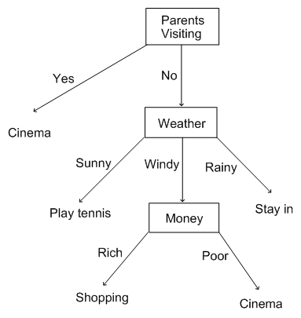

# JavaScript Functions Lab

## Introduction

This lab provides an opportunity to practice defining and coding some real-world functions.

>**Note:** Feel free to work in pairs or groups to complete this lab. Also, Google/StackOverflow is a good friend to have around...

## Exercise

#### Setup

1. Create an `index.html`.
2. Create a directory named `js`.
3. Create a file named `lab-functions.js` inside of the `js` directory.
4. Use a `<script>` element in the `<head>` of `index.html` to bring the `lab-functions.js` file into the web page.
5. The code in `lab-functions.js` will then execute whenever the page is loaded or refreshed.

#### Requirements

Define and code the functions below.

Define the functions using the approach as specified (either as a function expression or declaration).

Be sure to number each function with a comment above it.

After each function, call it **at least once** and `console.log` the results.

For example, here's the first function, my gift to you:

```js
// 1.
function maxOfTwoNumbers(x, y) {
  return x >= y ? x : y;
}

console.log(maxOfTwoNumbers(3, 9));

// 2.
...
```

Here are the functions:

1. (_completed above_) Define a function, as a function declaration, `maxOfTwoNumbers` that takes two numbers as arguments and returns the largest of them. If they are the same, return that number. Use the if-then-else construct.

2. Define a function, as a function expression, `maxOfThree` that takes three numbers as arguments and returns the largest of them.

3. Define a function, as a function declaration, `isCharAVowel` that takes a character as an argument and returns true if it is a vowel, false otherwise.

4. Define a function, as a function expression, `sumArray` that takes an array of numbers and returns the sum of those numbers. For example, `sumArray([2, 4, 5]);` would return `11`.

5. Define a function, as a function declaration, `multiplyArray` that takes an array of numbers and returns the product those numbers. For example, `multiplyArray([2, 4, 5]);` would return `40`.

6. Define a function, as a function expression, `numArgs` that returns the number of arguments passed to the function when called.

7. Define a function, as a function declaration, `reverseString` that takes a string, reverses the characters, and returns it. For example, `reverseString('rockstar');` would return the string "ratskcor".

8. Define a function, as a function expression, `longestWordLength` that takes an array of strings (words) and returns the length of the longest word.

9. Define a function, as a function declaration, `stringsLongerThan` that takes an array of strings and a number as arguments; and returns an array of the strings that are longer than the number passed in. For example, `stringsLongerThan(['touch', 'me', 'in', 'the', 'morning'], 2);` would return `["touch", "the", "morning"]`.

# Bonus - Logic & Conditionals

If you finish the lab and want more to do, do the exercises we didn't get to from the JS Logic & Conditionals lesson this morning:

1) There is an event with ticket prices that are `$50`, `$65`, `$85` for 
standard, premier, and premier plus (for drinks) seating. Seniors, veterans, 
and students receive a `$10` discount while standard patrons receive no 
discount. Based on hardcoded variables for `ticketType` and `discountType`, 
print out a patrons `ticketPrice`.

2) Write this decision tree as a conditional:



(you'll need three variables: parentsVisiting, weather, and money, and the conditional should output what you should do).

For an extra bonus, wrap it up in a function called whatShouldIDoToday()

3) Complete the following challenges using the ternary operator:

- Use conditionals to check if a hardcoded word is "javascript". If it is, `console.log` "Great language!"
- Use conditionals to check if a hardcoded number is `odd` or `even`, and then `console.log` the number is `odd` or `even` with the number's value.
- Use conditionals to check if a hardcoded number is divisible by `2` or  `3` and then `console.log` that the number is divisible by two or three.
- Use conditionals to check if a hardcoded `quantity` is `1` or greater than one. If the `quantity`  is one or greater `console.log` either `1 pet` or `quantity + " pets"` respectively.

## Additional Resources

- [MDN Functions](https://developer.mozilla.org/en-US/docs/Web/JavaScript/Guide/Functions)
