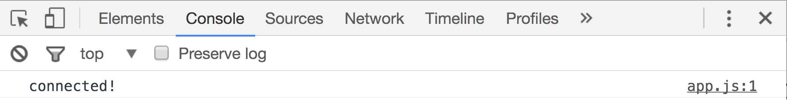

# Rock Paper Scissors Lab

## Set Up

Make an html file and a JS file. You are going to be writing JS, but in order to open your code in the browser you need an HTML file.

#### Connect JS to HTML

Just like with CSS, your JavaScript files need to be connected to your HTML document. With CSS we use a `<link>` tag; with JavaScript we use a `<script>` tag. Add a script tag in the `<head>` of your HTML document and source in your JS file.

If your project includes DOM manipulation (which we will cover later), the JavaScript needs to load *after* all of the HTML loads. Since there's no DOM manipulation in this project, we can load the JavaScript first, so it's fine where it is.

At this point, your entire HTML document should be something like:

```html
<!DOCTYPE html>
<html>
<head>
  <title>Rock Paper Scissors</title>
  <script type="text/javascript" src="./js/app.js"></script>
</head>
<body>
</body>
</html>
```

Now check the connection. Add this line to your JavaScript file:

```js
console.log('connected')
```

Open your HTML file in the browser and then open the Chrome Developer Tools (`command option i`) and click on the **console** tab. You should see this:



Your JavaScript is connected to your HTML!

## Rock Paper Scissors

Code a rock paper scissors game to be played in the console.

The rules of the game:

* Each player picks *rock*, *paper*, or *scissors*
* *Rock* beats *scissors*, *scissors* beats *paper*, and *paper* beats *rock*

Suggested steps:

* Allow the player to choose their move (consider [prompt()](http://www.w3schools.com/jsref/met_win_prompt.asp))
* Make a random choice for the computer (consider [Math.random()](http://www.w3schools.com/jsref/jsref_random.asp) and [Math.floor()](http://www.w3schools.com/jsref/jsref_floor.asp))
* Log both players' moves to the console
* Determine the winner using a conditional (`if` statement)
* Log a win message to the console

### Bonus

Want more of a challenge?

* Account for improper user input (what if the user enters "ROCK" or "Spock"?
* Make a `playToFive` function to keep track of the winner of each round and determine who wins 5 rounds first 