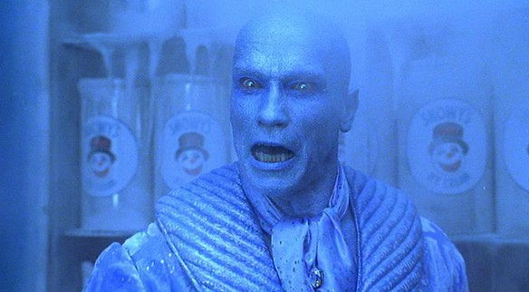

# After Hours!

# Finish JS Consructors Lab

There were 3 parts to this afternoon's lab.  Did you finish all 3?  After hours is the time to get through them all.  Once you get through them all...

# Arnold's Moronic Script

## Constructor Functions AH

Arnold wrote the worst script. Before he follows through with it all, you need to model it for him in JS so he can tell how terrible it is.

You can find the `starter_code/` directory in your class repo.

I found a copy of Arnold's script and included it in the starter code. Please fill out the "script" and model the screenplay so Arnold can tell how terrible his ideas really are.

