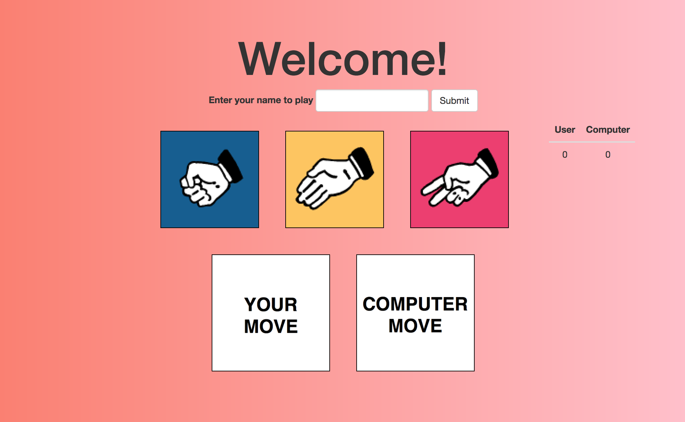
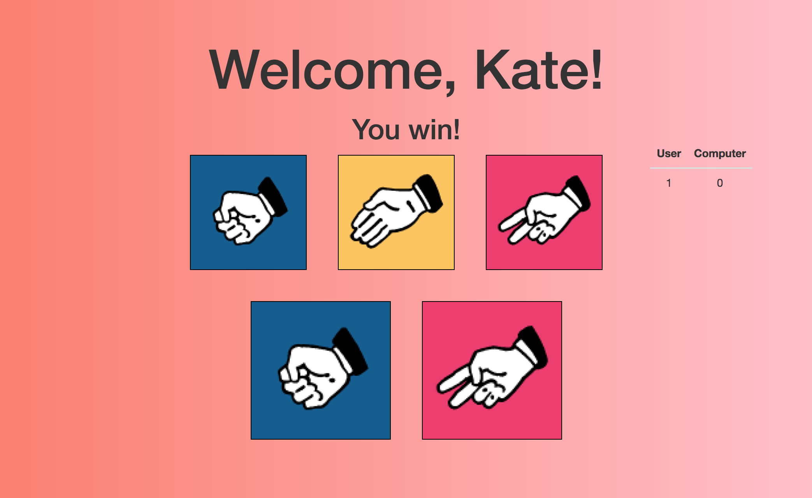

# Rock Paper Scissors with jQuery

Now that you've gotten an intro to jQuery and DOM manipulation, put it into practice! The [starter_code](./starter_code) already has HTML, CSS, images, and an empty JS file. Feel free to reference the [code along](../../00_rock_paper_scissors) from yesterday morning for guidance with the logic. Here are some screenshots of the goal finished product:

Initial screen (before a player enter's their name or clicks on a choice):

After first play:

## Tips

* first, walk through the HTML and CSS to make sure you understand your starting point
* remember to source in jQuery
* use pseudocode to define which steps you need to take in your code
* keep your console open!

## Bonuses

* a tournament function, so that whoever wins five in a row wins the tournament
* a reset button at the end of a tournament
* functionality that prevents the user from making a move before entering their name in the form