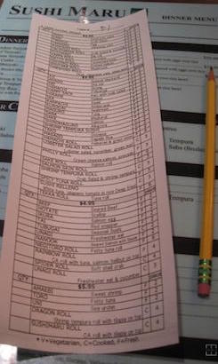

# It's A Ruby Buffet!

Welcome to Ruby everyone! There's so much here to enjoy: classes (datatypes),
operators and blocks, conditionals, loops, arrays, collections, and iterators.
It's a veritable *smörgåsbord* of code!

For your homework tonight, you have to order up some of the Ruby exercises 
below. **Complete the first two exercises** in 
**Control Flow**.

There are more, optional, exercises for collections, but they are bonuses only. We haven't gone over that in class yet!

## Control Flow

- **[Exercise 1](ruby_control_flow.md#exercise-1--help-me-obi-wan-kenobi)**
- **[Exercise 2](ruby_control_flow.md#exercise-2--youre-a-feisty-little-one)**
- [Exercise 3](ruby_control_flow.md#exercise-3--bounty-hunters--we-dont-need-that-scum)

## Collections

- [Exercise 1](ruby_collections.md#exercise-1--access-information-in-the-data-structure)
- [Exercise 2](ruby_collections.md#exercise-2--interact-with-the-data-in-the-structure)
- [Exercise 3](ruby_collections.md#exercise-3--add-and-remove-data-in-the-structure)
- [Exercise 4](ruby_collections.md#exercise-4--begin-working-with-the-data-structure)

## Methods - Bonus Bonus

We will be talking more about ruby methods later in the week.  If you want to challenge yourself, here is some ruby methods practice.

- [Ruby Methods](ruby_methods.md)

