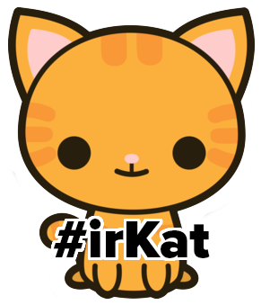

# After Hours!


## Rails CRUD!!!!!!!


Congrats, you have learned how to build the basic structure of a Rails-based web application. Next week, we will show you how to start building more complex apps, but first, you need to get the fundamental building blocks down. So....DO IT AGAIN!!!!  It's all about the reps early on. The less time you have to spend thinking about how to build a basic CRUD app, the more time you will have to build amazing features.

### First, finish the coffee shop app

Using the [excellent markdown from today](../10_our_first_rails_app/readme.md) as a guide, finish up the coffee shop app that we started in class.

### The irKat Shop 

Make an irKat shop instead of a coffee shop. Instead of beans, you will be CRUDing irkats (like Beanie Babies, but good at code). Your irkat model should have attributes of name, fur, likes_ruby (boolean), and quantity (an integer this time, nobody wants .3 of an irkat). Use the [coffee shop](../10_our_first_rails_app/readme.md) markdown for guidance!

Here are a couple seeds for you to start with.

```ruby
[{name: "Kate", fur: "reddish-brown", likes_ruby: true, quantity: 13},
{name: "Ira", fur: "bearded", likes_ruby: true, quantity: 10}]
```

Now make a full CRUD app so you can add the 19 other irkats in the irKat shop (hint: you are one of them). As always, HAVE FUN!!!!!