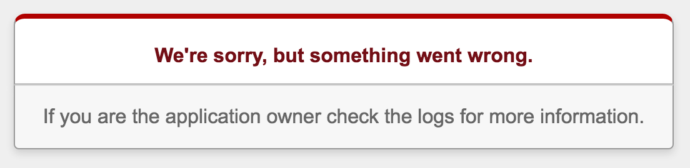

#HEROKU DEPLOYMENT

##"Deploy early, deploy often"

###OBJECTIVES

* Setup a Heroku account
* Download and install Heroku Toobelt
* `heroku create`
* `heroku run`
* `heroku logs`

--
***What is Heroku?***

- A cloud-based service that allows you to deploy your Rails app using Git

--

#### Set Up for Heroku

1. Go to [signup.heroku.com](https://signup.heroku.com/) and sign up for a free Heroku account. Make a note of your email and password combo for heroku - you will need these!

2. Download and install [toolbelt.heroku.com](https://toolbelt.heroku.com). This is the toolbelt for Heroku and allows you to interact with Heroku from your command line.

3. `$ heroku login` (prompts for email and password)

4. In terminal, navigate to the project you would like to deploy. Open it in your text editor of choice. 

5. Specify your ruby version at the bottom of your `Gemfile`. To find out which version you are using, type `ruby -v` anywhere in your terminal. Add it to the bottom of your gemfile in this format:  
	`ruby '2.3.3'` 	

6. Set a root route in `routes.rb`. Remember that the default "Yay!" message isn't part of your project, so it won't work in production mode.

7. `$ heroku create` 
  - you can pass an app name as an argument (`heroku create my-app-name`), or don't and heroku will give you one like *calm-waters55600*.
  - Name must start with a letter and can only contain lowercase letters, numbers, and dashes.

8. `$ heroku git:remote -a YOURHEROKUAPPNAME` this adds your new heroku app as a remote repository for this rails project

9. Make sure everything is up to date on origin/master by commiting and pushing to github

10. `$ git push heroku master` Heroku will automatically deploy your master branch, regardless of what you push. There is a way to get heroku to deploy a different branch, but you should always deploy your master branch. There is no reason to push other branches to heroku. *Keep your master branch deploy-ready at all times!*
   * This project is a great time to start branching! Work on feature branches and merge them into the master branch when new features are ready to deploy.

11. Last thing: There are a couple of great tools we have been using in development: 
	* Rails console
	* Rake commands

	To access these tools in heroku (remotely) we can use them in EXACTLY the same way, except we need to prepend `heroku run`:
	
	* `heroku run rake db:migrate`
	* `heroku run rake db:seed`
	* `heroku run rails c`

12. Your *development* database is different than your *production* database. If you want your deployed version to have data right away, make sure to use your seed file.
	> Note: you do not have to run `rake db:create` for your production database.
	
13. `$ heroku open` will open your app on heroku in your default web browser.

14. Each day, push your changes to your GitHub repo *and* Heroku and least once.

Done! 

##Heroku Logs: 

If there is an error in production, heroku will not display the red screen of constructive criticism, because it doesn't want to expose your secrets to any old internet user who comes across your site. Instead, you will see a generic error message telling you to check the logs.

Run `heroku logs` in your terminal and it will display all of the server logs so you can find where it all went wrong.

More questions on heroku deployment?
	
### When in doubt, check [the docs](https://devcenter.heroku.com/articles/getting-started-with-rails5).
