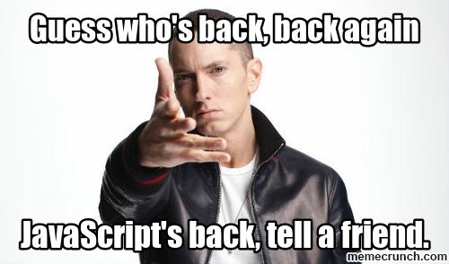

# Weekend Prep!!!

### Bye Ruby

You won't have much time to continue working on your project 2 until after the course is finished, so take a few minutes to write yourself some notes/comments about anything you want to add or change.

### Back to JavaScript

Next week we jump back into the world of JavaScript and say goodbye to our friend, Ruby. We highly suggest you take the weekend to brush up on your JavaScript. Here are some options to help you out:

1. [Class Markdowns!!!](../../01_week/)
2. [Codecademy](https://www.codecademy.com/learn/javascript)
3. [Nodeschool.io javascripting course](https://github.com/workshopper/javascripting)
4. [Sololearn?](https://www.sololearn.com/)