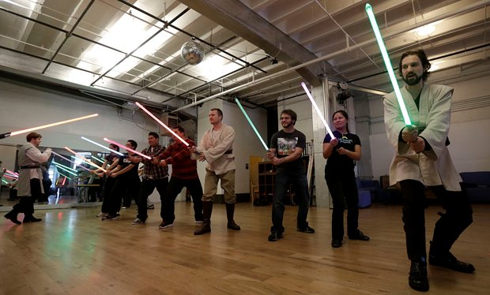
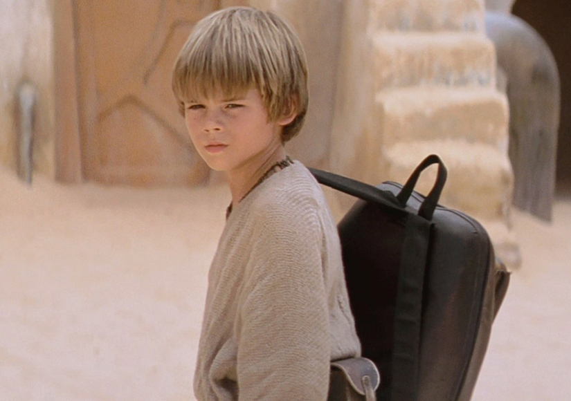
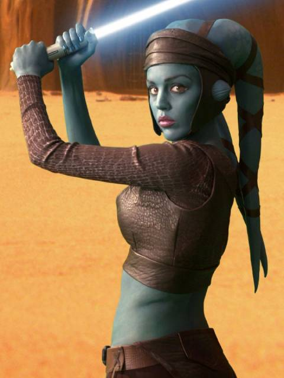
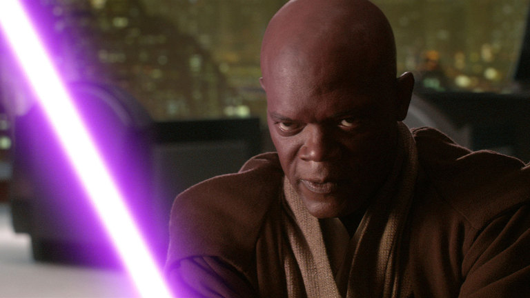

# Star Wars Jedi Coding Academy
---

Strong in the coding force you are! But you must complete your training to become a master Jedi coder. The following code wars problems test your basic Javascript skills. Try to complete at least the Padawan level problems. The higher ranks get progressively harder -- the ones at the jedi and master levels are ones that most people will not be able to get at this point in the course. Feel free to return to this lab and try the harder problems throughout the rest of the course.

### Padawan Level 
---

[Exclusive Or](http://www.codewars.com/kata/exclusive-or-xor-logical-operator)

[Count The Monkeys](http://www.codewars.com/kata/count-the-monkeys)

[Do I Get A Bonus](http://www.codewars.com/kata/do-i-get-a-bonus)

[Days In The Year](http://www.codewars.com/kata/days-in-the-year)

[Leo And The Oscars](http://www.codewars.com/kata/leonardo-dicaprio-and-oscars)

### Apprentice Level

[Calculate The Mean](http://www.codewars.com/kata/get-the-mean-of-an-array)

[Alternating Case](http://www.codewars.com/kata/alternating-case-%3C-equals-%3E-alternating-case)

[Luigi and Mario Pipe Problem](http://www.codewars.com/kata/lario-and-muigi-pipe-problem)

[Conference Traveler](http://www.codewars.com/kata/conference-traveller)

### Jedi Level

[After Midnight](http://www.codewars.com/kata/after-midnight)

[Help Mr E](http://www.codewars.com/kata/help-mr-e)

[Parts of List](http://www.codewars.com/kata/parts-of-a-list)

[Which Triangle?](http://www.codewars.com/kata/which-triangle-is-that)

[Nth Longest In Array](http://www.codewars.com/kata/find-the-nth-longest-string-in-an-array)

[Memory](http://www.codewars.com/kata/a-memory-game-array)

### Master Level

[Phone Directory](http://www.codewars.com/kata/phone-directory)

[I like Big Nums](http://www.codewars.com/kata/i-love-big-nums-and-i-cannot-lie)

[IP4 Parser](http://www.codewars.com/kata/ipv4-parser)

[The Union Jack](http://www.codewars.com/kata/the-union-jack)
