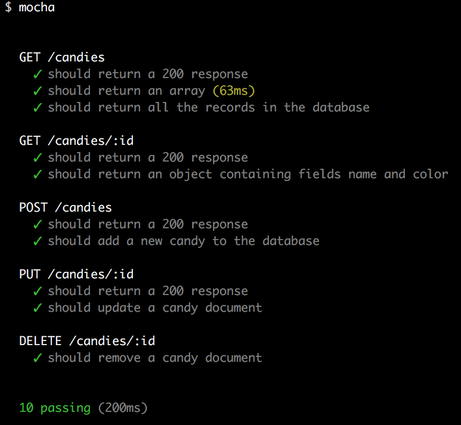

# Testing with Mocha/Chai Lab

## Introduction

> ***Note:*** _This can be a pair programming activity or done independently._

Now that we've written a few tests in our Express application from the previous lesson, it's your turn to practice writing more tests using a more complex version of our Candies app that uses MongoDB and has more functionality.

At the end of this lab, you should have tests written to make sure our index works properly, our show pages return the information we need, we can update and post a candy, and we can delete a candy from our database.


## Exercise

#### Requirements

- Set up the app to run mocha, chai and supertest
- Implement these tests:


```
GET /candies
  ✓ should return a 200 response
  ✓ should return an array
  ✓ should return all the records in the database

GET /candies/:id
  ✓ should return a 200 response
  ✓ should return an object containing fields name and color

POST /candies
  ✓ should return a 200 response
  ✓ should add a new candy to the database

PUT /candies/:id
  ✓ should return a 200 response
  ✓ should update a candy document

DELETE /candies/:id
  ✓ should remove a candy document
```

Notice that some of these tests are the same as tests we wrote together during the last lesson. I strongly encourage you not to copy and paste. Type them out! Even if you read what we did last module and type identical tests in this app, you are likely to retain more if you go through the process of typing it all out.

* If you include the model Candy in your spec file, you can execute requests to MongoDB directly from the test file, allowing you to watch the database directly before or after an action made by a test

**Bonus:**

- There is a validation on the color field allowing only certain colors for the field "color" - add the tests for it
- Add fields with different types and write tests for them

#### Starter code

The starter code contains an app with a candy controller and a mongoose model.

#### Deliverable

This is the output you should get in the terminal:



Runtime may vary 🙂

## Additional Resources

- [Chai](http://chaijs.com/)
- [Mocha](https://mochajs.org/)
- [Mongoose Validations](http://mongoosejs.com/docs/validation.html)