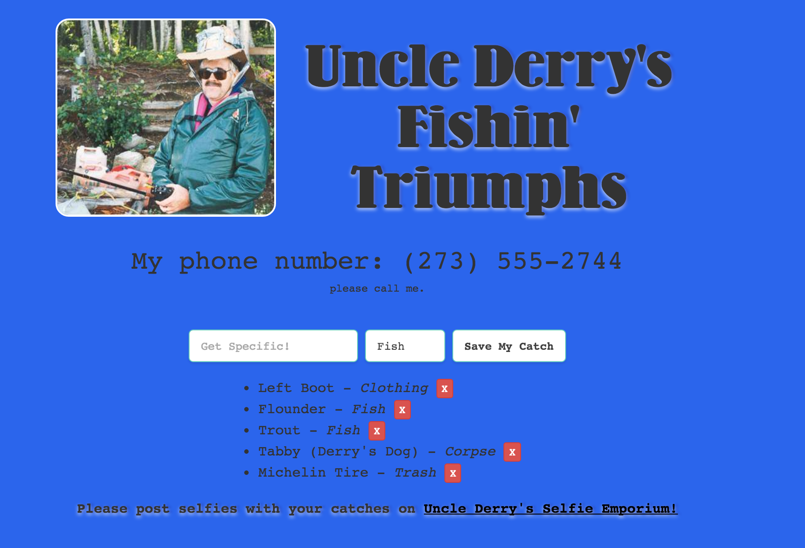

# After Hours!


# Talk to your group

As we mentioned this morning, there will be no scheduled class time this week to work on your pitches. We highly recommend that you meet with your group during office hours, for at least a little bit, and start to come up with project ideas, agree on code style conventions, figure out what roles people will be taking and who is responsible for what, etc. Once you are ready to work on your coding skills so that you can contribute as much as possible to your group...

# Option 1

Continue the [AJAX lab](../03_ajax_lab/readme.md) from this morning.

# Option 2

Continue the [testing lab](../05_intro_to_testing_lab/readme.md) from this afternoon.

# Option 3

## Fix Derry's Site!


## Practicing AJAX

You're about to write a lot of AJAX-backed JavaScript that will complete Uncle Derry's Fishin' Triumphs Page.

To get started, copy the [starter_code](./starter_code) into your workspace and call it `derrys_fishin_api`. Don't forget to `npm install`!

Before working on your client side javascript, ensure that you've run both `mongod` (if necessary on your machine) and `nodemon` in your `derrys_fishin_api` directory within your terminal. The starter code has some seeds. To add them to your database, you just run the seed file with node. From the root of your project:

```bash
node config/seeds
```

Your task is to use your JS & JQuery skills to list out all the
"fish" in our database and add in a form so we can add more catches, edit existing ones, and delete the less than glamorous.

## Part 1

- Use AJAX to populate the fishes list
- Create a form that uses AJAX to POST a new fish

## Part 2

- Create a form that uses AJAX to PUT or PATCH a fish
- Delete an existing API resource from your client using AJAX

## Bonus

- Style the site to look like the deliverable

#### Deliverable



## Additional Resources

- [Using AJAX Tutorial Video](https://www.youtube.com/watch?v=fEYx8dQr_cQ&index=7&list=PLoYCgNOIyGABdI2V8I_SWo22tFpgh2s6_)
- [jQuery AJAX Docs](http://api.jquery.com/jquery.ajax/)
- [Some useful jQuery DOM Manipulation Docs](http://api.jquery.com/prepend/)
