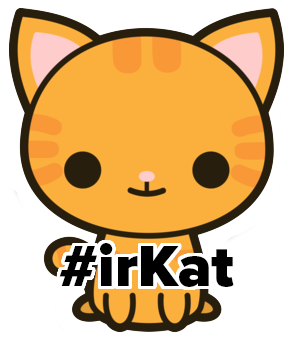

# After Hours!


# Work on your Inception Deck

As we mentioned yesterday, there will be no scheduled class time this week to work on your pitches. You must have an [Inception Deck](../../../projects/project3/inception_deck) ready to present on Friday morning, so don't delay! Get to work on that this evening.

# Do the repl.it Challenge with your group!

It's good practice to start working together!

# Build an  Shop!

If you didn't catch everything from today, or if you just want more practice, put your skills from this unit to use and build an irKat Shop app and CRUD irKats. Your irKat model should have attributes of name, fur, likes_node (boolean), and quantity.

Here are a couple seeds for you to start with:

```js
[{name: "Kate", fur: "reddish-brown", likes_node: true, quantity: 13},
{name: "Ira", fur: "bearded", likes_node: true, quantity: 10}]
```

Now make a full CRUD app so you can add more irKats in the irKat shop. As always, HAVE FUN!!!!!
