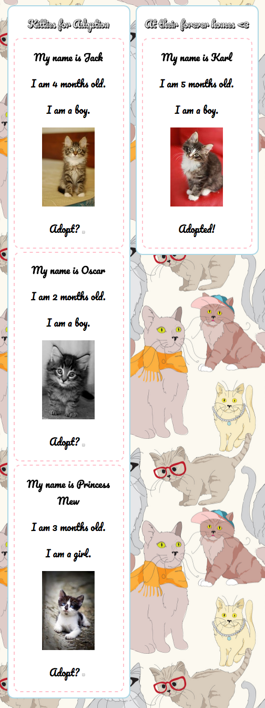

# Build an Angular App from Scratch!

##### Good afternoon! Today you're going to take some time to go off on your own and complete a very important quest. A quest to SAVE SOME KITTIES!

#### Learning Objectives
* Practice some of your newly aquired AngularJS skills!
* Be able to build a small AngularJS app ***on your own***
* Save some **kitties**!

```
				   /\     /\
				  {  `---'  }    (Save me, please!)
				  {  O   O  }      .
				~~|~   V   ~|~~	  .
				   \  \|/  /	 .
				    `-----'__		
				    /     \  `^\_
				   {       }\ |\_\_   W
				   |  \_/  |/ /  \_\_( )
				    \__/  /(_E     \__/
				      (  /
				       MM
```

#### Your Quest...
* Save some kitties by building a Kitties Adoption app in Angular
* Rely on your newly aquired Angular skills to build out this app and fullfill your quest
* Copy the [starter code](./starter_code) outs of the class repo and into your workspace
* If you want git practice, create a repository for your app: `git add`, `git commit`, and `git push` while you're working
* **Have fun and good luck!**

#### Some Angular directives and parts you'll be implementing and relying on...
```
		ng-app
		ng-controller
		ng-model
		ng-repeat
		ng-src
		and... filters!

```

#### Deliverable


#### Bonus Challenges
* Add new kitties who need to be adpoted to your app *from the browser*
* Make it so once a cat is adopted, it can't be un-adopted (that's terrible!)
* Incorporate a Google font or other font of your choice into the app
* Get creative and remember, ***have fun*** :)