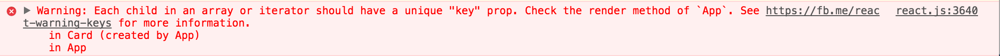

# Intro to [React](https://facebook.github.io/react/docs/getting-started.html)


## SWBAT
* Explain the basic components of React.JS like: JSX, Babel, Virtual DOM, Components, and Props
* Create a simple React.JS application which uses props

<!--##Roadmap

* Intro
* Why use React?
* JSX, Virtual DOM, Components, Props, and State
* Webpack, Babel, Flux
* Lab-->

## Intro

React is a new generation front end framework, made by Facebook. It turns what we used to previously know about "separation of concerns" upside down - and allows us to create HTML components that are controlled by JS. 

## Why use React.JS?

- Rendering speed (performance)
- Reduced complexity reasoning through an app
- It's what facebook uses

## Key Elements
### JSX
JSX is a JavaScript extension that adds XML syntax to JavaScript. This allows us to return HTML (views) inside our JavaScript code.

Browsers do not run JSX natively, so we need to transpile our code with [Babel](https://babeljs.io/).

### Virtual DOM

- Diffing engine.
- Much faster than DOM in web browser.
- Figures out which changes need to be made in actual DOM, THEN makes only those changes to actual DOM since that process is much slower.

### Components
These are the main elements we work with in react. They are similar to custom directives in Angular. A component is an element we can use and reuse in our views.

We name components 

```jsx
var MyTitle = React.createClass({
  render: function () {
    return (
      <h1>My Title component</h1>
    );
  }
});
```

Then we can reference them in JSX like this:

```jsx
<MyTitle />
```

### Props
Short for "properties". Props are data passed in from a parent component, available as a 'property' on the child component. Using props, we will be able to read the data passed to the Comment (child component) from the CommentList (parent component), and render some markup. Props are immutable (meaning you can't modify their value after creating them).

These 'properties' are accessed through `this.props`.

Props flow down (parent to child).


### State
State allows us to change properties in our component. For example, we can modify a variable and have our DOM re-render to show the value.

Accessed through `this.state`.

State flows up (child to parent).


---
<!--
Components can have props: Data passed in from a parent component is available as a 'property' on the child component. These 'properties' are accessed through this.props. Using props, we will be able to read the data passed to the Comment from the CommentList, and render some markup. -->

Other things to know about: 

* [Webpack](https://webpack.github.io/) is a module bundler.

* [Babel](https://babeljs.io/) is a JS transpiler.

<!--* [Flux](https://facebook.github.io/flux/docs/overview.html) is an architecture that Facebook uses internally when working with React. It is not a framework or a library. It is simply a new kind of architecture that complements React and the concept of Unidirectional Data Flow.

	That said, Facebook does provide a repo that includes a Dispatcher library. The dispatcher is a sort of global pub/sub handler that broadcasts payloads to registered callbacks.

	A typical Flux architecture will leverage this Dispatcher library, along with NodeJS’s EventEmitter module in order to set up an event system that helps manage an applications state.

	For a better explaination look here: [What is Flux?](http://fluxxor.com/what-is-flux.html)

	There are several alterative implementations including: Reflux, Redux, and Alt.

	Which one to pick? 
[this](http://stackoverflow.com/questions/32461229/why-use-redux-over-facebook-flux) is an interesting article about redux vs flux.

	And [Comparing all of them](http://jamesknelson.com/which-flux-implementation-should-i-use-with-react/).-->

## Practice

Let's go back to the `react-tutorial` directory we made earlier today.

This is what we have so far in `index.html`:

```html
<!DOCTYPE html>
<html>
  <head>
    <meta charset="UTF-8" />
    <title>Hello React!</title>
    <script src="https://unpkg.com/react@latest/dist/react.js"></script>
    <script src="https://unpkg.com/react-dom@latest/dist/react-dom.js"></script>
    <script src="https://unpkg.com/babel-standalone@6.15.0/babel.min.js"></script>
  </head>
  <body>
    <div id="root"></div>
    <script type="text/babel" src="./js/app.jsx"></script>
  </body>
</html>
```

This is what we have so far in `app.jsx`:

```jsx
ReactDOM.render(
  <h1>Hello, world!</h1>,
  document.getElementById('root')
);
```

Clear out `app.jsx`. We're going to start over in that file. Let's hard-code an array in `app.js` to work with:

```jsx
var people = [
  {
    "name"   : "Tom",
    "avatar" : "https://s3.amazonaws.com/uifaces/faces/twitter/craigrcoles/128.jpg",
    "id"     : 0
  },
  {
    "name"   : "Dan",
    "avatar" : "https://s3.amazonaws.com/uifaces/faces/twitter/ivanfilipovbg/128.jpg",
    "id"     : 1
  },
  {
    "name"   : "Ben",
    "avatar" : "https://s3.amazonaws.com/uifaces/faces/twitter/abovefunction/128.jpg",
    "id"     : 2
  },
  {
    "name"   : "Alan",
    "avatar" : "https://s3.amazonaws.com/uifaces/faces/twitter/ryandownie/128.jpg",
    "id"     : 3
  }
]
```

Step 1:  
Let's practice writing our first component

```jsx
var App = React.createClass({
  getInitialState : function () {
    return people[0];
  },

  render : function () {
    return (
      <div className="jumbotron">
        <h1>{this.state.name}</h1>
        
      </div>
    );
  }
});

ReactDOM.render(
  <App></App>,
  document.getElementById('root')
);
```

Let's get our `http-server` running and check out our progress in the browser!

> If your browser is still showing "Hello, world!" do a hard refresh on the browser window (⌘ ⇧ r).

Step 2:  
We need to extract the component from the 'app' and then use props to bind to the array

```jsx
var Card = React.createClass({
  render : function () {
    return (
      <div className="jumbotron">
        <h1>{this.props.name}</h1>
        
      </div>
    );
  }
});

var App = React.createClass({
  getInitialState: function () {
    return {
      people: people
    }
  },
  render: function () {
    return(
      <div className="container">
      {this.state.people.map(function (person) {
        return (
          <Card name={person.name} avatar={person.avatar} />
        );
      })}
      </div>
    );
  }
});

ReactDOM.render(
  <App />,
  document.getElementById('root')
);
```

This should give you your classic example of an app that renders dynamic content based on an array.

But, wait! There's an error in our console.




Let's click on the link in the error message and investigate!

The items in our people array already have an id property, so we can use that for the key. Let's update the App component:

```jsx
var App = React.createClass({
  getInitialState : function () {
    return {
      people : people
    }
  },
  render : function () {
    return(
      <div className="container">
      {this.state.people.map(function (person) {
        return (
          <Card name={person.name} avatar={person.avatar} key={person.id}></Card>
        );
      })}
      </div>
    );
  }
});
```

## Resources

### Webpacks and Babel
Great explanation of why you'd use both of them, and what they do: 

* [https://tylermcginnis.com/react-js-tutorial-1-5-utilizing-webpack-and-babel-to-build-a-react-js-app-5f804d729d3b](https://tylermcginnis.com/react-js-tutorial-1-5-utilizing-webpack-and-babel-to-build-a-react-js-app-5f804d729d3b)

### Flux
[Flux](https://facebook.github.io/flux/docs/overview.html) is an architecture that Facebook uses internally when working with React. It is not a framework or a library. It is simply a new kind of architecture that complements React and the concept of Unidirectional Data Flow.

That said, Facebook does provide a repo that includes a Dispatcher library. The dispatcher is a sort of global pub/sub handler that broadcasts payloads to registered callbacks.

A typical Flux architecture will leverage this Dispatcher library, along with NodeJS’s EventEmitter module in order to set up an event system that helps manage an applications state.

For a better explaination look here: [What is Flux?](http://fluxxor.com/what-is-flux.html)

There are several alterative implementations including: Reflux, Redux, and Alt.

Which one to pick? 
[this](http://stackoverflow.com/questions/32461229/why-use-redux-over-facebook-flux) is an interesting article about redux vs flux.

And [Comparing all of them](http://jamesknelson.com/which-flux-implementation-should-i-use-with-react/).


## Conclusion

- Which way do props flow?
- Which way does state flow?
- Can you render a component inside another component?


